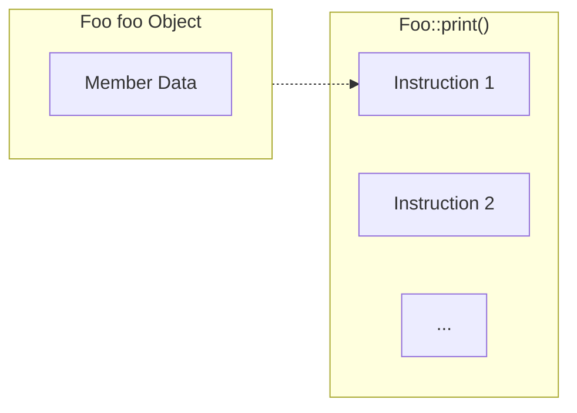
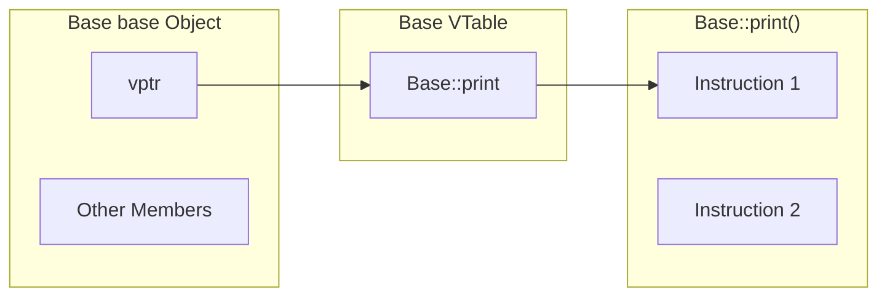
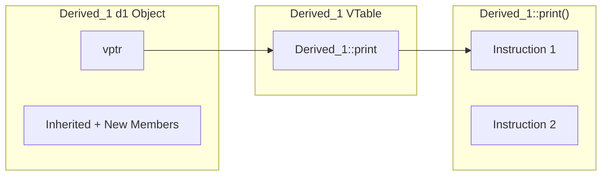
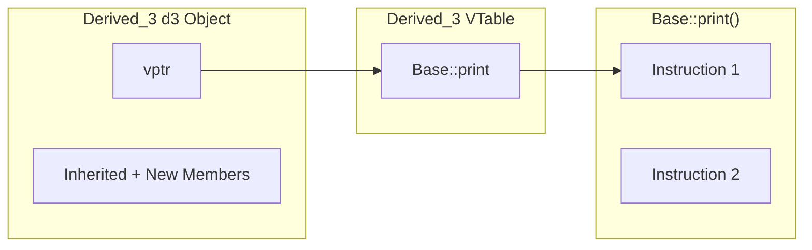
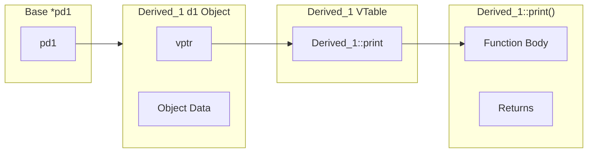
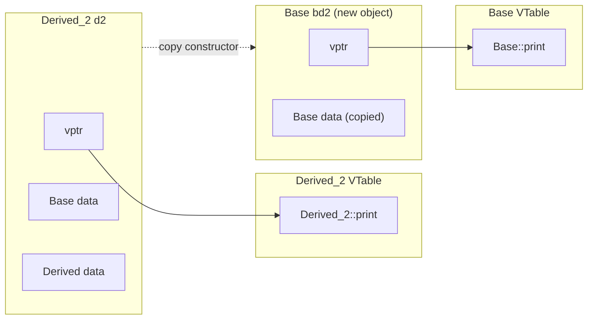

Polymorphism is a fundamental concept in C++ inheritance that enables runtime method resolution. While the concept itself is straightforward, many students struggle with complex polymorphism scenarios. Understanding the underlying mechanism—rather than simply memorizing the behavior—provides deeper insight and helps avoid common pitfalls.

## Basic Polymorphism Example

Let's start with a comprehensive example that demonstrates various polymorphism scenarios:

```cpp
#include <iostream>

class Base 
{
public:
    virtual void print()
    {
        std::cout << "Print in Base" << std::endl;
    }
};

class Derived_1 : public Base
{
public:
    void print() override
    {
        std::cout << "Print in Derived_1" << std::endl;
    }
};

class Derived_2 : public Base
{
public:
    void print() override
    {
        std::cout << "Print in Derived_2" << std::endl;
    }
};

class Derived_3 : public Base
{
    // No override - inherits Base::print()
};

class Derived_1_1 : public Derived_1
{
    // No override - inherits Derived_1::print()
};

int main()
{
    Base base{};
    base.print();         // OUTPUT: Print in Base

    Derived_1 d1{};
    d1.print();           // OUTPUT: Print in Derived_1

    Derived_2 d2{};
    d2.print();           // OUTPUT: Print in Derived_2

    Derived_3 d3{};
    d3.print();           // OUTPUT: Print in Base
                          // Since Derived_3 doesn't override print(), it calls Base::print()

    // Polymorphism via pointers
    Base *pd1 = &d1;
    pd1->print();         // OUTPUT: Print in Derived_1
                          // Polymorphism in action - calls Derived_1::print()

    // Polymorphism via references
    Base &rd2 = d2;
    rd2.print();          // OUTPUT: Print in Derived_2
                          // Reference enables polymorphism - calls Derived_2::print()

    Base *pd3 = &d3;
    pd3->print();         // OUTPUT: Print in Base
                          // Polymorphism works, but calls Base::print() (no override in Derived_3)

    // Object slicing - no polymorphism
    Base bd2 = d2;        // Creates a new Base object (slicing occurs)
    bd2.print();          // OUTPUT: Print in Base
                          // bd2 is a Base object, not a Derived_2 object

    // Multi-level inheritance
    Derived_1_1 d11{};
    d11.print();          // OUTPUT: Print in Derived_1
                          // Inherits Derived_1::print()

    Base &rd11 = d11;
    rd11.print();         // OUTPUT: Print in Derived_1
                          // Polymorphism calls the most derived override
    
    return 0;
}
```

## The Mechanism Behind Polymorphism

Understanding how polymorphism works requires examining memory layout and function resolution at runtime.

### 1. Non-Virtual Functions

For regular (non-virtual) functions, the function call is resolved at compile time based on the static type:

```cpp
class Foo
{
public:
    void print();
};

Foo foo{};
```

The memory layout is straightforward - the function name directly points to the function's memory location:



### 2. Virtual Functions and the VTable

When a class declares virtual functions, the compiler automatically adds a hidden member variable called `vptr` (virtual pointer) to enable runtime polymorphism.

**Base Class with Virtual Function:**



**Derived Class with Override:**



**Derived Class without Override:**



### 3. Polymorphic Function Resolution

When using pointers or references to base class objects, the runtime system follows the `vptr` to resolve the correct function:



### 4. Object Slicing: When Polymorphism Doesn't Work

The assignment `Base bd2 = d2;` invokes the copy constructor, creating a new `Base` object. This is called **object slicing** because the derived portion is "sliced off":



## Key Takeaways

1. **Virtual Function Mechanism**: Virtual functions are resolved through a vtable lookup at runtime, not compile time.

2. **VPtr and VTable**: Every object with virtual functions contains a hidden `vptr` that points to its class's vtable.

3. **Polymorphism Requirements**: True polymorphism requires:
   - Virtual functions in the base class
   - Pointers or references to base class objects
   - The actual object being of a derived type

4. **Object Slicing**: Direct assignment creates a new object of the static type, losing the derived behavior.

5. **Inheritance Chain**: If a derived class doesn't override a virtual function, it inherits the most recent override from its inheritance chain.

Understanding these mechanisms helps explain why polymorphism works in some cases but not others.