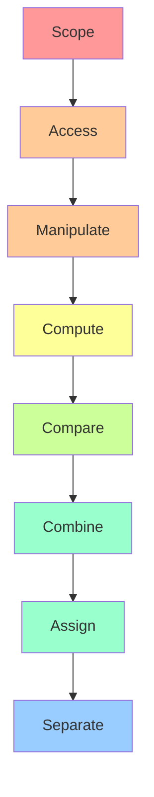

C++ has numerous operators, each with its own precedence for compiler evaluation. Additionally, different groups of operators have specific associativity rules—most are left-to-right, while others are right-to-left. It can be frustrating to memorize all these rules. In this article, I will try to better organize and explain the underlying reasoning.

# Concepts

- **Precedence**: Determines which operator is evaluated first when multiple operators appear in one expression. Operators with higher precedence are evaluated before those with lower precedence.
- **Associativity**: Determines the order in which operators with the same precedence are evaluated.
- **Underlying Purpose**: These rules resolve ambiguities when the compiler evaluates expressions.

# Patterns for Precedence

C++ operators can be categorized into several groups based on their functionality, and their precedences often align with intuitive mathematical or programming conventions. Here are the groups and patterns for better memorization.

## 1. Scope Resolution (Precedence Level 1)

- Operator `::` (scope resolution) has the **highest** precedence.
- **Pattern**: Before any operation (like member access, arithmetic, or function calls), the compiler must know exactly which entity (class, namespace, or global) is being referred to.
- **Example**:
```cpp
std::vector<int>::iterator it;  // Must resolve `std::vector<int>::` first
::globalFunction();             // Explicitly calls the global function
```

## 2. Member Access and Postfix (Precedence Level 2)

- Operators like `.` (member access), `->` (pointer member access), `++` (postfix increment), `--` (postfix decrement), `()` (function call), and `[]` (array subscript) have very high precedence.
- **Pattern**: These are fundamental because they define what you're working with. You must identify the object before performing any other operations.
- **Examples**:
```cpp
obj.member + 5;     // Means `(obj.member) + 5`, not `obj.(member + 5)`
ptr->func()[0];     // Means `(ptr->func())[0]`, not `ptr->(func()[0])`
*ptr++;             // Interpreted as `*(ptr++)`, not `(*ptr)++`
obj.func().data++;  // Interpreted as `(((obj.func)()).data)++` (left-to-right associativity)
```

## 3. Unary Operators (Precedence Level 3)

- Operators like `++` (prefix increment), `--` (prefix decrement), `!` (logical NOT), `~` (bitwise NOT), `+` (unary plus), `-` (unary minus), `*` (dereference), and `&` (address-of) have high precedence.
- **Pattern**: Unary operators act on a single operand, either modifying it or computing a derived value. They bind tightly to their operands.
- **Note**: Prefix `++/--` modify the value and return the new value, while postfix `++/--` return the original value then modify it.

> Additionally, operators like `sizeof`, `typeid`, `const_cast`, `dynamic_cast`, `reinterpret_cast`, `static_cast`, `new`, `new[]`, `delete`, and `delete[]` are all unary operators with precedence level 3.

## 4. Member Pointer Access (Precedence Level 4)

- Operators `.*` and `->*` have precedence level 4.
- In practice, they are rarely used. They are binary operators where the first operand must be of class type `T` (or a reference to it), and the second operand must be a pointer to a member of class type `T`.
- **Example**:
```cpp
class MyClass {
public:
    int value;
    void func() { std::cout << "Hello\n"; }
};
MyClass obj;
MyClass* ptr = &obj;
int MyClass::*member_ptr = &MyClass::value;
void (MyClass::*func_ptr)() = &MyClass::func;
obj.*member_ptr = 42;    // Access member through object
(ptr->*func_ptr)();      // Call function through pointer
```

## 5. Arithmetic Operators (Precedence Levels 5-6)

- Binary arithmetic operators follow mathematical convention: multiplicative operators (`*`, `/`, `%`) have higher precedence (level 5) than additive operators (`+`, `-`) at level 6.
- **Example**:
```cpp
int result = 2 + 3 * 4;     // Evaluates as 2 + (3 * 4) = 14, not (2 + 3) * 4 = 20
int mod = 17 % 5 + 2;       // Evaluates as (17 % 5) + 2 = 2 + 2 = 4
```

> **Important**: The precedence of operators only affects expression grouping; it does not determine the order of evaluation. For example:
```cpp
int a = 5;
int temp = ++a * 3 + a--;  // Undefined behavior!
```
The expression is grouped as `((++a) * 3) + (a--)`, but the evaluation order is not guaranteed. This creates undefined behavior because `a` is modified twice without an intervening sequence point. To fix this:
```cpp
int a = 5;
int b = ++a;           // a becomes 6, b is 6
int temp = b * 3 + a--;  // Now well-defined: 6 * 3 + 6 = 24, then a becomes 5
```

## 6. Bitwise Shift (Precedence Level 7)

- Shift operators `<<` and `>>` are used for left and right bit shifting (and stream I/O when overloaded).
- **Pattern**: These operators need to be evaluated after arithmetic calculations are complete.
- **Example**:
```cpp
int x = 5 + 3 << 2;         // Evaluates as (5 + 3) << 2 = 8 << 2 = 32
std::cout << "Value: " << x;  // Stream operators (overloaded << for output)
```

## 7. Relational and Equality Operators (Precedence Levels 8-9)

- Relational operators (`<`, `>`, `<=`, `>=`) have higher precedence (level 8) than equality operators (`==`, `!=`) at level 9.
- **Pattern**: Comparisons should operate on the results of calculations, so their precedence is lower than arithmetic operators.
- **Example**:
```cpp
bool result1 = 5 + 3 > 2 * 3;     // Evaluates as (5 + 3) > (2 * 3) = 8 > 6 = true
bool result2 = x < y == z > w;    // Evaluates as (x < y) == (z > w)
```

## 8. Bitwise Operators (Precedence Levels 10-12)

- Bitwise operators have relatively low precedence: `&` (level 10), `^` (level 11), `|` (level 12).
- **Pattern**: This follows C language convention, which considers bitwise operations as low-level and less commonly used than comparisons.
- **Example**:
```cpp
int result = 8 | 4 & 2;         // Evaluates as 8 | (4 & 2) = 8 | 0 = 8
bool mask = x > 0 & y < 10;     // Evaluates as (x > 0) & (y < 10)
```

## 9. Logical Operators (Precedence Levels 13-14)

- Logical AND `&&` (level 13) has higher precedence than logical OR `||` (level 14).
- **Pattern**: When writing code, we often combine comparison results, so these should have lower precedence than comparisons.
- **Example**:
```cpp
bool result = x > 0 && y < 10 || z == 5;    // Evaluates as ((x > 0) && (y < 10)) || (z == 5)
bool valid = a != 0 && b / a > 2;           // Short-circuit: if a == 0, b/a won't be evaluated
```

## 10. Conditional and Assignment (Precedence Levels 15-16)

- Conditional operator `?:` has precedence level 15.
- All assignment operators (`=`, `+=`, `-=`, `*=`, `/=`, `%=`, `<<=`, `>>=`, `&=`, `|=`, `^=`) have precedence level 16.
- **Pattern**: These operators store result values and should be among the last operators evaluated.
- **Example**:
```cpp
int result = x > 0 ? y + 1 : z - 1;    // Evaluates as x > 0 ? (y + 1) : (z - 1)
x = y = z + 5;                         // Right-to-left: x = (y = (z + 5))
a += b > c ? 10 : 5;                   // Evaluates as a += ((b > c) ? 10 : 5)
```

## 11. Throw and Comma (Precedence Levels 17-18)

- `throw` has precedence level 17, and comma operator `,` has the lowest precedence at level 18.
- **Pattern**: The order is intuitive—we need to capture the whole expression for exceptions, and the comma operator is only for separating expressions, not computing them.
- **Example**:
```cpp
throw x > 0 ? MyException("positive") : MyException("non-positive");
// Evaluates as: throw (x > 0 ? MyException("positive") : MyException("non-positive"))
int a = 1, b = 2, c = a + b;    // Declares and initializes multiple variables
int result = (x = 5, y = 10, x + y);  // Comma operator: result = 15, x = 5, y = 10
```

# Associativity

Only three operator groups have **right-to-left** associativity:

1. **Unary operators**: They are placed directly before variables, so right-to-left evaluation is natural.
2. **Assignment operators**: This makes sense because these operators use the rightmost value to assign to the left.
3. **Conditional operator**: `a ? b : c ? d : e` is evaluated as `a ? b : (c ? d : e)`.

All other operators have **left-to-right** associativity.

# Practical Memory Aid

Although I've tried to simplify these concepts, they can still seem complicated. In practice, some operators are rarely used. You can use this intuitive hierarchy for remembering:



When in doubt, use parentheses to make your intentions explicit—it improves code readability and prevents bugs.

I hope this helps clarify C++ operator precedence and associativity!